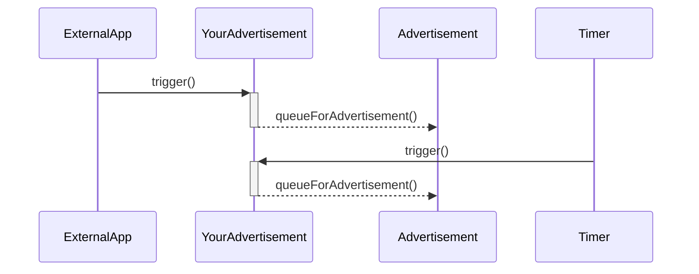

# BLE module

This is the abstraction layer for bluetooth low energy.
It is based on the Nordic Softdevice and support a range of different advertisements.

## Advertisement class

The advertsing class is an abstract class.
To implement an advertising inherit from it. Implement the virtual trigger functions.
When triggered, start gathering data. When done with that, add the data to the adv queue by calling queueForAdvertisement.
For static data this is one step, for dynamic data and sensors this can be implemented asynchronosly.



## Services and Characteristics

These handle all the connected communications.
A service can consist of multiple characteristics, which represent data values.

### Example

Here is a short example on how to use a custom Service with a custom
characteristic. It is read and writeable and will print a log upon change.

Add it above your main function to try it out.

```cpp
IO::BLE::Service                  commService{};
IO::BLE::Characteristic<uint16_t> commandChar{commService,
                                              {.broadcast        = false,
                                               .read             = true,
                                               .writeNoResponse  = false,
                                               .write            = true,
                                               .notify           = false,
                                               .indicate         = false,
                                               .authSignedWrites = false},
                                              0x1234};

class Observer : public Patterns::Observer<uint16_t> {
public:
    Observer(Patterns::Observable<uint16_t>& commandChar)
        : Patterns::Observer<uint16_t>(commandChar)
    {}

    virtual void handle(Patterns::Observable<uint16_t>& observable,
                        uint16_t                        value) final
    {
        LOG_D("Received %u", value);
    }
};

Observer observer(commandChar);
```

## Warnings

- The Softdevice checks packages passed to it by sd_ble_gap_adv_set_configure() for consistency. If you have strange errors with that, check your format with the BLE standard.